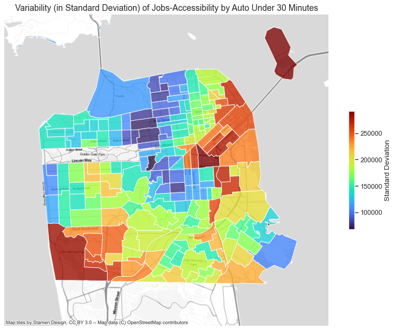

## Temporal Variations of Auto Jobs-Accessibility by Time of Day in San Francisco

### Research Questions 

**How does auto jobs-accessibility vary by time of day?**

Jobs-Accessibility is a common transportation metric used in transportation analysis and research. It is a measure of the number of jobs that can be accessed from a certain location. Cevero defined “accessibility” within a regional context as the “the opportunities to reach places across the region”. The “places” in jobs-accessibility measures are jobs, or more precise, locations with jobs.  

Jobs-accessibility measures depends on three factors: the locations of people’s place of residence (origin), the locations of jobs (destination), and the time and cost to reach these jobs from people’s place of residence (impedance). Jobs-accessibility depends on both transportation and land use: the relative location of individuals and jobs matter.

Work on accessibility typically focuses on spatial variations. Spatial variations of accessibility points to the crucial connection between transportation and land use, it also shows disparate access to opportunities. 

A facet of accessibility that is less discussed but that is the impetus for this research is jobs-accessibility’s temporal aspect. The variability in travel conditions suggests that impedance never remains constant across time. Travel conditions change in different times of day because of congestion. In times when congestion is severe, travel time increases and accessibility decreases.  

The operationalization of accessibility metrics in research and in professional practice often negates the temporal variability of accessibility by time of day. Accessibility measures often have granularity at the daily level. Even sophisticated activity-based models such as SF-Champ account only for temporal variations of accessibility in 5 time periods per day instead of for all hours of day. 

This analysis focuses on the time-of-day variations of jobs-accessibility. Ostensibly, people working in shifts that are not the typical 9am-5pm would have different levels of jobs access. Also, given the increasing hybrid and flexible nature of work, more workers may commute in different hours outside of the traditional peak hours. A more granular understanding of temporal variations can help us better understand travel behavior and access to job opportunities. 

**Are there opportunities to use big data to measure jobs-accessibility?** 

The Uber Movement dataset is a publicly availability dataset collected and made available by Uber. Unlike traditional travel demand modelling in which travel time is determined from network impedance, the Uber Movement dataset is a form of big data based on actual trips. The Uber Movement dataset provides travel time estimates between census tracts based on their anonymized data on Uber trips. The granularity of the travel time data is at hour of day. 

The use of big data instead of network impedance calculations has a few advantages. First, they reflect actual travel behavior that has occurred and do not rely on assumptions and estimations of travel speed. Second, big data has a much larger sample size compared to the typical travel survey sample sizes used to validate travel demand models 

For my analysis, I will study temporal variations of accessbility by using Uber Movement’s weekday hour-of-day travel time data for the San Francisco Bay Area in 2019. 

### Scope (Specific Research Question) 

How does auto jobs-accessibility vary by time of day in San Francisco? 

### Data and Methodology 
- Various types of accessibility metrics 
- Uber Movement Data 
- Census and MTC Job Projections 
- What should I measure?  

 </div>


### Data Quality and Limitations 

### Findings 

### Key Conclusions  

### References 


Markdown is a lightweight and easy-to-use syntax for styling your writing. It includes conventions for

```markdown
Syntax highlighted code block

# Header 1
## Header 2
### Header 3

- Bulleted
- List

1. Numbered
2. List

**Bold** and _Italic_ and `Code` text

[Link](url) and 
```

For more details see [Basic writing and formatting syntax](https://docs.github.com/en/github/writing-on-github/getting-started-with-writing-and-formatting-on-github/basic-writing-and-formatting-syntax).

### Jekyll Themes

Your Pages site will use the layout and styles from the Jekyll theme you have selected in your [repository settings](https://github.com/matthui1/access_variability/settings/pages). The name of this theme is saved in the Jekyll `_config.yml` configuration file.

### Support or Contact

Having trouble with Pages? Check out our [documentation](https://docs.github.com/categories/github-pages-basics/) or [contact support](https://support.github.com/contact) and we’ll help you sort it out.
